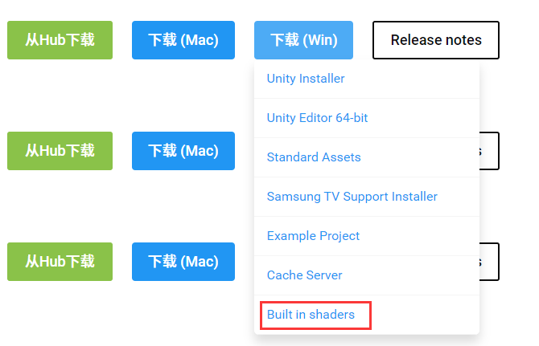
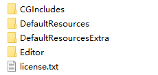

**CGIncludes**下载

Unity封装非常多的Shader库**CGIncludes**可以再[官网](Unity.cn)下载到。



解压后的文件如下，其中包含了封装的.cginc文件以及内置Shader源码。学习Shader的时候查阅很有必要。



### 完整代码

```js
Shader "Unlit/Shader05"
{
    Properties
    {
        _MainColor("Color",Color)= (1,0,0,1)
    }
    SubShader
    {
        Pass
        {
            CGPROGRAM
            #pragma vertex vert
            #pragma fragment frag
            
            // 引入UnityCG.cginc
            #include "UnityCG.cginc"

            struct v2f
            {
                float4 pos :SV_POSITION;
            };
            
            fixed4 _MainColor ;

            // 传入appdata_base结构体
            v2f vert (appdata_base v)
            {
                v2f o;
                o.pos = UnityObjectToClipPos(v.vertex);
                return o ;
            }

            fixed4 frag (v2f i) :SV_Target
            {
                return _MainColor;
            }
            ENDCG
        }
    }
}
```

引入```UnityCG.cginc```删除输入结构体```a2v```传入```appdata_base```且Shader依然起效。因为```UnityCG.cginc```进行了封装。

### 封装的输入结构体

````js
struct appdata_base {
    float4 vertex : POSITION;
    float3 normal : NORMAL;
    float4 texcoord : TEXCOORD0;
    UNITY_VERTEX_INPUT_INSTANCE_ID
};

struct appdata_tan {
    float4 vertex : POSITION;
    float4 tangent : TANGENT;
    float3 normal : NORMAL;
    float4 texcoord : TEXCOORD0;
    UNITY_VERTEX_INPUT_INSTANCE_ID
};

struct appdata_full {
    float4 vertex : POSITION;
    float4 tangent : TANGENT;
    float3 normal : NORMAL;
    float4 texcoord : TEXCOORD0;
    float4 texcoord1 : TEXCOORD1;
    float4 texcoord2 : TEXCOORD2;
    float4 texcoord3 : TEXCOORD3;
    fixed4 color : COLOR;
    UNITY_VERTEX_INPUT_INSTANCE_ID
};
````

> 也封装了输出结构体，但使用较少。还有诸多内置函数详情查阅```CGIncludes```。

