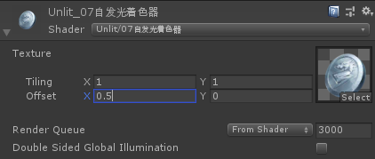

## UV控制

07自发光Shader如果调解材质球面板UV属性会发现没有效果。



原因是并没有对UV与面板参数做运算，如同自定义声明的面板参数一样。

```js
// 需要把此段代码一起移动到  v2f vert (appdata v) 函数上面。CG语言是从上往下运行的。
sampler2D _MainTex;
float4 _MainTex_ST;	// 声明一个与贴图同名_ST 的float4
```

```v2f vert (appdata v)```函数修改如下:

```js
// o.uv = v.uv;
o.uv =TRANSFORM_TEX(v.uv,_MainTex); // 面板UV计算
```

``` TRANSFORM_TEX``` 是内置的Unity帮我们计算好的函数，只需要使用即可。可以在**CGIncludes**中找到。

## UV流动

既然面板是由uv数值控制的，那么理所当然的就可以使用自定义的方式移动。Shader中提供了一个``_Time``的float2向量会随着时间增加。

```js
// u方向随着时间相加
o.uv.x += _Time.x; // += 就是 o.uv.x = o.uv.x + _Time.x 的简写
```


在给shader增加一个```Speed```属性。后续此类型代码就不再单独列出来了，比较简单直接观看源码。

```js
// ------------ Properties面板声明 ------------
 _Speed("_Speed",float) = 1

// ------------ CGPROGRAM内部声明 ------------
float _Speed;

// ------------ v2f vert (appdata v) ------------
o.uv.x += _Time.x * _Speed;	// UV流动 U方向
```

拓展V方向同逻辑，就不再编写了

>  提示：初始时阅读代码比较困难。配合源码使用查找工具查找跳转对应代码对比理解比较容易。

## 完整代码

```js
Shader "Example01/07UV流动"
{
    Properties
    {
        _MainTex ("Texture", 2D) = "white" {}
        _Speed("_Speed",float) = 1  // 速度属性
    }
    SubShader
    {
        
        Tags
        { 
            // 渲染顺序 - 透明
            "Queue" = "Transparent"
            // 着色器替换 - 透明
            "RenderType" = "Transparent"
            // 面板预览形状 - 片<默认显示的是球形的>
            "PreviewType" ="Plane"
        }
        
        Cull Off		// 剔除 关闭
        Lighting Off	// 灯光 关闭
        ZWrite Off		// 深度缓冲 关闭
        // Blend SrcAlpha One                  //Add模式
        Blend SrcAlpha OneMinusSrcAlpha     //Blended模式
        Pass
        {
            CGPROGRAM
            #pragma vertex vert
            #pragma fragment frag
            #include "UnityCG.cginc"

            struct appdata
            {
                float4 vertex : POSITION;
                float2 uv : TEXCOORD0;
            };

            struct v2f
            {
                float2 uv : TEXCOORD0;
                float4 vertex : SV_POSITION;
            };

            sampler2D _MainTex;
            float4 _MainTex_ST;
            float _Speed;

            v2f vert (appdata v)
            {
                v2f o;
                o.vertex = UnityObjectToClipPos(v.vertex);
                // o.uv = v.uv;
                o.uv =TRANSFORM_TEX(v.uv,_MainTex); // 面板UV计算
                o.uv.x += _Time.x * _Speed;         // UV流动 U方向
                // o.uv.y += _Time.x * _Speed;      // UV流动 V方向
                return o;
            }

            fixed4 frag (v2f i) : SV_Target
            {
                fixed4 col = tex2D(_MainTex, i.uv);
                return col;
            }
            ENDCG
        }
    }
}
```

> 下章介绍贴图的基础计算混合叠加等