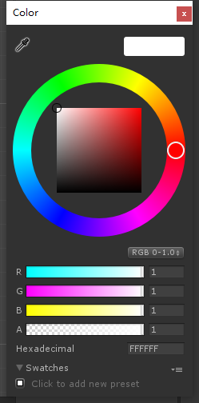
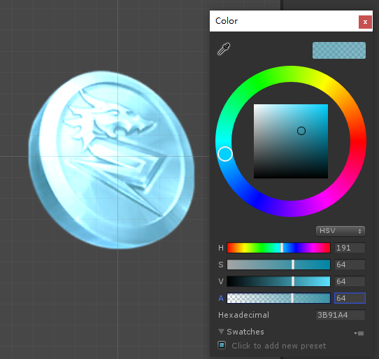
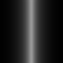
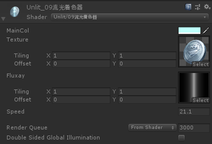

此章概要介绍下Shader中的基础叠加方式，及加减乘除。结合上一章的UV移动实现一个流光效果。

## 理论知识



首先颜色的构成是由RGB三个通道外加A透明通道构成，数值是从0 > 1，叠加方式其实就是对RGBA的数值运算。

首先我们先复制一份```08UV着色器```改名``` 09流光着色器```给其添加上颜色属性。

> 我们通常工作的时候使用的是HSV颜色模式方便直观调色

```js
Shader "Example01/08UV流光"
{
	// ....
}
```


```js
// ------------ Propertie ------------
_MainCol("MainCol",Color)= (1,1,1,1)
    
// ------------ CGPROGRAM ------------
float4 _MainCol;
```

先测试一下加法，这就是我们特效中经常用到的所谓Add<英文也是加的意思>

```js
// ------------ fixed4 frag (v2f i) : SV_Target ------------
fixed4 col = tex2D(_MainTex, i.uv);
// 直接加上面板_MainCol颜色
return col + _MainCol;
```

此时显示效果全白了通道也没有了,再面板颜色明度调低.能看到图案了像是Add了一层颜色上去，但是通道没有了。开始拆分下其运算。

```js
// col 贴图的颜色
// _MainCol 面板的颜色
// fixed4 float4 ？前面知识讲到过都是4向量。及 r g b a
// 再来换算一下刚才的 return col + _MainCol 运算
// return 返回的意思
col.r + _MainCol.r
col.g + _MainCol.g
col.b + _MainCol.b
col.a + _MainCol.a
```

相当于图片RGBA通道分别加上了面板颜色。**0是黑色	1是白色**  在加上面板颜色时图像是全白。因为所加数值都超过1了。如果把面板数值都设置成0图片就正常显示了。

## 测试代码

清理了一些注释 方便关注重心

```js
Shader "Example01/08UV流光"
{
    Properties
    {
        _MainCol("MainCol",Color)= (1,1,1,1)
        _MainTex ("Texture", 2D) = "white" {}
        _Speed("Speed",float) = 1
    }
    SubShader
    {
        Tags
        { 
            "Queue" = "Transparent"
            "RenderType" = "Transparent"
            "PreviewType" ="Plane"
        }
        
        Cull Off
        Lighting Off
        ZWrite Off
        Blend SrcAlpha OneMinusSrcAlpha
        Pass
        {
            CGPROGRAM
            #pragma vertex vert
            #pragma fragment frag
            #include "UnityCG.cginc"

            struct appdata
            {
                float4 vertex : POSITION;
                float2 uv : TEXCOORD0;
            };

            struct v2f
            {
                float2 uv : TEXCOORD0;
                float4 vertex : SV_POSITION;
            };

            float4 _MainCol;
            sampler2D _MainTex;
            float4 _MainTex_ST;
            float _Speed;

            v2f vert (appdata v)
            {
                v2f o;
                o.vertex = UnityObjectToClipPos(v.vertex);
                o.uv =TRANSFORM_TEX(v.uv,_MainTex);
                o.uv.x += _Time.x * _Speed;
                return o;
            }

            fixed4 frag (v2f i) : SV_Target
            {
                fixed4 col = tex2D(_MainTex, i.uv);
                // 加上面板 _MainCol 颜色
                return col + _MainCol;
            }
            ENDCG
        }
    }
}
```

在理解了加法原理后，别的运算符也就自然清楚了。通常“实物”混合方式都是通过乘法进行运算。

```js
// 自行测试
return col * _MainCol;
```

特效上使用的Add加法运算则是：

```js
// 按照美术习惯计算方式
// 只进行 RGB 计算用 _MainCol 的 A 通道去控制 _MainCol.RGB 的颜色强度
col.rgb += _MainCol.rgb* _MainCol.a;
return col;
```



别的运算符自行测试，Shader编程称之为图形学。既然是视觉类就没有绝对唯一，只要是你想要的效果那就是对的计算方式。

## 拓展流光

在清楚原理后我们进行流光的拓展，首先我们先添加一张流光的贴图



进行属性添加 声明

```js
// ------------ Properties ------------
_Fluxay ("Fluxay", 2D) = "black" {}   // black 这里指得贴图默认黑色

// ------------ CGPROGRAM ------------
sampler2D _Fluxay;
float4 _Fluxay_ST;
```

```js
// ------------ fixed4 frag (v2f i) : SV_Target ------------
fixed4 fluxay = tex2D(_Fluxay, i.uv);
```

```fluxay ``` 也是一个4向量 和上面的_MainCol属性一样进行相加即可。

```js
col.rgb += fluxay.rgb; // 没有A通道需要运算 直接进行RGB运算即可
return col;
```


计算结果如上，如果设置面板Speed属性会发现图片也跟着一起流动起来了。这并不是想要的效果，原因是：

```js
fixed4 col = tex2D(_MainTex, i.uv);
fixed4 fluxay = tex2D(_Fluxay, i.uv);
```

两张贴图采用的是同一个UV 位移时自然就一起位移了，我们需要做的是再添加一套UV。

```js
// ------------ struct v2f ------------
float2 uv2 : TEXCOORD1; //添加一套UV

// ------------ v2f vert (appdata v) ------------
o.uv2 =TRANSFORM_TEX(v.uv,_Fluxay);    // 面板计算赋值uv2
// o.uv.x += _Time.x * _Speed;
o.uv2.x -= _Time.x * _Speed;            // uv2进行位移

// ------------ fixed4 frag (v2f i) : SV_Target ------------
fixed4 fluxay = tex2D(_Fluxay, i.uv2);	// 采样使用uv2
col.rgb += fluxay.rgb * _MainCol.rgb * _MainCol.a;  // 混合颜色
```




> 完成这些计算就到了一个流光效果的材质球。但不适用于UI精灵等组件。它们需要额外的控件属性计算才能正确的显示与UI层级遮盖裁剪

## 完整代码

```js
Shader "Example01/08UV流光"
{
    Properties
    {
        _MainCol("MainCol",Color)= (1,1,1,1)
        _MainTex ("Texture", 2D) = "white" {}
        _Fluxay ("Fluxay", 2D) = "black" {}
        _Speed("Speed",float) = 1
    }
    SubShader
    {
        Tags
        { 
            "Queue" = "Transparent"
            "RenderType" = "Transparent"
            "PreviewType" ="Plane"
        }
        
        Cull Off
        Lighting Off
        ZWrite Off
        Blend SrcAlpha OneMinusSrcAlpha
        Pass
        {
            CGPROGRAM
            #pragma vertex vert
            #pragma fragment frag
            #include "UnityCG.cginc"

            struct appdata
            {
                float4 vertex : POSITION;
                float2 uv : TEXCOORD0;
            };

            struct v2f
            {
                float4 vertex : SV_POSITION;
                float2 uv : TEXCOORD0;
                float2 uv2 : TEXCOORD1; //添加一套UV
            };

            float4 _MainCol;
            sampler2D _MainTex;
            float4 _MainTex_ST;
            float _Speed;
            sampler2D _Fluxay;
            float4 _Fluxay_ST;

            v2f vert (appdata v)
            {
                v2f o;
                o.vertex = UnityObjectToClipPos(v.vertex);
                o.uv =TRANSFORM_TEX(v.uv,_MainTex);
                o.uv2 =TRANSFORM_TEX(v.uv,_Fluxay);    // 面板计算赋值uv2
                // o.uv.x += _Time.x * _Speed;
                o.uv2.x -= _Time.x * _Speed;            // uv2进行位移
                return o;
            }

            fixed4 frag (v2f i) : SV_Target
            {
                fixed4 col = tex2D(_MainTex, i.uv);
                fixed4 fluxay = tex2D(_Fluxay, i.uv2);  // 采样使用uv2
                col.rgb += fluxay.rgb * _MainCol.rgb * _MainCol.a;  //混合颜色
                return col;
            }
            ENDCG
        }
    }
}
```

> 下一章介绍扭曲着色器，更好的理解向量运算