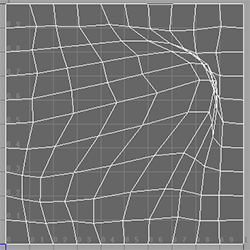

首先复制一下09的自发光Shader，做了最初始化的代码编写可以用来做开始的模板。

## 理论知识

特效上实现扭曲的方式有几种方式，不依靠Shader的情况下可以把建立的特效模型把UV或则顶点打乱。有时会也会使用此方式实现一些特定的效果。



上图为打乱面片的UV,我们先来看下正常的面片UV和打乱的面片UV。<07拓展知识>中**调试方法工具**中有介绍到。这里再简要的概括下。

```js
// fixed4 col = tex2D(_MainTex, i.uv);
// uv的属性时一个 2 向量 那么表示它就能转换 输出查看。
float2 uv : TEXCOORD0;

// 输出查看
 return fixed4(i.uv,0,1); //转换成4向量 b通道没有就填成0 a通道需要填写成1 不然就透明了
```


左边是正常输出的UV颜色，右边是拉伸过的。会发现颜色是不一样的，由此可以得出uv也是可以通过颜色来控制的。

## 测试实现

先声明一个扭曲贴图 外加一个控制的数值。找一张特效常用的扭曲图。

```js
// Properties
_ContortTex("ContortTex",2D) ="bump"{}
_Contort("Contort",Range(-1,1)) = 1
// CGPROGRAM
sampler2D _ContortTex;
float _Contort;

```


理解原理后就很清楚图为什么“长”这样了。只是在R ，G通道上加上了躁波然后采样对应运算到UV向量上。实现打乱UV的效果。代码如下

```js
fixed4 frag (v2f i) : SV_Target
{
    fixed4 contortTex = tex2D(_ContortTex, i.uv);
    // 扭曲打乱
    i.uv -= contortTex.rg * 0.1 * _Contort;
    fixed4 col = tex2D(_MainTex, i.uv);
    return col;
}
```

此时的显示图形就变成了扭曲的，再结合前几章节UV 流光知识就能实现流动的效果了。


## 完整代码

```js
Shader "Example01/09扭曲扰动"
{
    Properties
    {
        _MainTex ("Texture", 2D) = "white" {}
        _ContortTex("ContortTex",2D) ="bump"{}
        _Contort("Contort",Range(-1,1)) = 1
        _Speed("Speed",Range(0,10)) =1
    }
    SubShader
    {
        Tags
        { 
            // 渲染顺序 - 透明
            "Queue" = "Transparent"
            // 着色器替换 - 透明
            "RenderType" = "Transparent"
            // 面板预览形状 - 片<默认显示的是球形的>
            "PreviewType" ="Plane"
        }
        
        Cull Off		// 剔除 关闭
        Lighting Off	// 灯光 关闭
        ZWrite Off		// 深度缓冲 关闭
        // Blend SrcAlpha One                  //Add模式
        Blend SrcAlpha OneMinusSrcAlpha     //Blended模式
        Pass
        {
            CGPROGRAM
            #pragma vertex vert
            #pragma fragment frag
            #include "UnityCG.cginc"

            struct appdata
            {
                float4 vertex : POSITION;
                float2 uv : TEXCOORD0;
            };

            struct v2f
            {
                float4 vertex : SV_POSITION;
                float2 uv : TEXCOORD0;
                float2 uv2 : TEXCOORD1; // 声明UV2
            };

            sampler2D _MainTex;
            float4 _MainTex_ST;
            sampler2D _ContortTex;
            float4 _ContortTex_ST;
            float _Contort;
            float _Speed;
            
            v2f vert (appdata v)
            {
                v2f o;
                o.vertex = UnityObjectToClipPos(v.vertex);
                o.uv =TRANSFORM_TEX(v.uv,_MainTex);
                o.uv2 =TRANSFORM_TEX(v.uv,_ContortTex); // 采样第二套UV
                o.uv2.x +=_Time.x * _Speed;             // 偏移UV
                return o;
            }
            fixed4 frag (v2f i) : SV_Target
            {
                fixed4 contortTex = tex2D(_ContortTex, i.uv2);
                i.uv -= contortTex.rg * 0.1 * _Contort; // 扭曲打乱
                fixed4 col = tex2D(_MainTex, i.uv);
                return col;
            }
            ENDCG
        }
    }
}
```

> 下一章介绍溶解裁剪