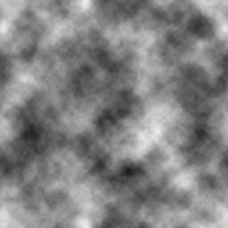

## 理论知识

前面已经阐述重复过比较多Shader的固定代码了，后续就不在重复了复制粘贴用即可。直接进入主要的代码讲解。

首先溶解就是通过RGBA中的A通道计算，数字是0-1美术上就是黑白颜色。

首先准备一张黑白通道图做好采样处理，以及一个0-1的参数控制。



## 判断if else

这种不常用 GPU不擅长做判断处理，但是也介绍一下。

```js
fixed4 col = tex2D(_MainTex, i.uv);
fixed3 dissolveCol = tex2D(_DissolveTex, i.uv);
// 声明一个alpha颜色
fixed alphaCol = 1;
// 判断计算
// if (dissolveCol.r > _Value)
// {
//     alphaCol = col.a;
// }
// else
// {
//     alphaCol = 0;
// }
// 简化 三目运算符
alphaCol = dissolveCol.r > _Value ? col.a : 0;
return fixed4(col.rgb ,alphaCol);
```

给一个限定的值如果大于就保留小于就直接等于0这就是溶解的运行逻辑。三目运算符是简写详情百度Google必应。

## step

内置函数 如果 x<a，返回 0；否则，返回 1。可以代替if

```js
fixed4 col = tex2D(_MainTex, i.uv);
fixed3 dissolveCol = tex2D(_DissolveTex, i.uv);
// 根据使用习惯翻转了_Value
fixed alphaCol = step(dissolveCol,1 -_Value) * col.a;
return fixed4(col.rgb,alphaCol);
```

## clip

内置函数 会将参数小于0的像素点直接剔除，这里牵扯到AlphaTest 透明度测试，现在只需要知道字面意思即可。硬裁剪推荐使用这种方式。

```js
fixed4 col = tex2D(_MainTex, i.uv);
fixed3 dissolveCol = tex2D(_DissolveTex, i.uv);
// 直接作用于最开始的像素剔除
clip(dissolveCol.r - _Value);
return col;
```


## 完整代码 - 硬裁剪

```js
Shader "Example01/10溶解-硬裁剪"
{
    Properties
    {
        _MainTex ("Texture", 2D) = "white" {}
        _DissolveTex("DissolveTex",2D) ="white" {}
        _Value("Value",Range(0,1)) = 0
    }
    SubShader
    {
        Tags
        { 
            "Queue" = "Transparent"
            "RenderType" = "Transparent"
            "PreviewType" ="Plane"
        }
        
        Cull Off
        Lighting Off
        ZWrite Off
        Blend SrcAlpha OneMinusSrcAlpha

        Pass
        {
            CGPROGRAM
            #pragma vertex vert
            #pragma fragment frag
            #include "UnityCG.cginc"

            sampler2D _MainTex;
            sampler2D _DissolveTex;
            float _Value;

            struct appdata
            {
                float4 vertex : POSITION;
                float2 uv : TEXCOORD0;
            };

            struct v2f
            {
                float2 uv : TEXCOORD0;
                float4 vertex : SV_POSITION;
            };

            v2f vert (appdata v)
            {
                v2f o;
                o.vertex = UnityObjectToClipPos(v.vertex);
                o.uv = v.uv;
                return o;
            }

            fixed4 frag (v2f i) : SV_Target
            {
                fixed4 col = tex2D(_MainTex, i.uv);
                fixed3 dissolveCol = tex2D(_DissolveTex, i.uv);
                // 直接作用于最开始的像素剔除
                clip(dissolveCol.r - _Value);
                return col;
            }
            ENDCG
        }
    }
}
```

## 软裁剪计算

前面学习了裁剪的基础流程，只需要处理溶解的“黑白图”采样后再给主纹理使用就好了。所以调整一张黑白图的过度就能实现软裁剪，就和PS拉曲线调整颜色之类的一样。计算方式有很多不代表唯一，此处只是编写了自己觉得效果OK的计算方式。

>**引用前面说过的话：**Shader编程称之为图形学。既然是视觉类就没有绝对唯一，只要是你想要的效果那就是对的计算方式。

使用到的函数方法

- **lerp(a, b, f)**函数
- 计算(1− f )∗ + ∗a b   f 或者a+ f ∗ −(b a)的值。即在下限 a 和上限 b 之间进行插值，f 表示权值。注意，如果 a 和 b 是向量，则权值 f 必须是标量或者等长的向量。

- **saturate(x)** 函数
  - 如果 x 小于 0，返回 0；如果 x 大于 1，返回1；否则，返回 x

```js
    fixed4 col = tex2D(_MainTex, i.uv);
    fixed3 dissolveCol = tex2D(_DissolveTex, i.uv);
    // 把数值转换到 0-2
    dissolveCol += 1;
    // 属性值翻转到 0-2
    fixed value = _Value * -2;
    // 通过加减控制黑白颜色
    dissolveCol += value;
	// 计算使得更锐利也可以暴露 0 这个数值来调节柔和度
    dissolveCol =lerp(dissolveCol,0,value);
    // 控制在 0 和 1 之间
    fixed alphaCol = saturate(dissolveCol) * col.a;
    return fixed4(col.rgb ,alphaCol); 
```


## 完整代码 - 软裁剪

```js
Shader "Example01/11溶解-软裁剪"
{
    Properties
    {
        _MainTex ("Texture", 2D) = "white" {}
        _DissolveTex("DissolveTex",2D) ="white" {}
        _Value("Value",Range(0,1)) = 0
        _Soft("Soft",Range(0,10)) = 0
    }
    SubShader
    {
        Tags
        { 
            "Queue" = "Transparent"
            "RenderType" = "Transparent"
            "PreviewType" ="Plane"
        }
        
        Cull Off
        Lighting Off
        ZWrite Off
        Blend SrcAlpha OneMinusSrcAlpha

        Pass
        {
            CGPROGRAM
            #pragma vertex vert
            #pragma fragment frag
            #include "UnityCG.cginc"

            sampler2D _MainTex;
            sampler2D _DissolveTex;
            float _Value;
            float _Soft;

            struct appdata
            {
                float4 vertex : POSITION;
                float2 uv : TEXCOORD0;
            };

            struct v2f
            {
                float2 uv : TEXCOORD0;
                float4 vertex : SV_POSITION;
            };

            v2f vert (appdata v)
            {
                v2f o;
                o.vertex = UnityObjectToClipPos(v.vertex);
                o.uv = v.uv;
                return o;
            }

            fixed4 frag (v2f i) : SV_Target
            {
                fixed4 col = tex2D(_MainTex, i.uv);
                fixed3 dissolveCol = tex2D(_DissolveTex, i.uv);
                // 把数值转换到0-2
                dissolveCol += 1;
                // 属性值翻转到0-2
                fixed value = _Value *-2;
                // 通过加减控制黑白颜色
                dissolveCol += value;
                // 计算使得更锐利
                dissolveCol =lerp((ldexp(dissolveCol,_Soft)),0,value);
                // 控制在0 和 1 之间
                fixed alphaCol = saturate(dissolveCol) * col.a;
                return fixed4(col.rgb ,alphaCol); 
            }
            ENDCG
        }
    }
}
```

> 下一章介绍通道的灵活运用