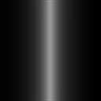

## 理论知识

如果细心你会发现前面的Shader都只是采用了一个通道来实现效果。流光Shader只是取了R通道来做计算。扭曲的UV也只是采用了RG两个通道使用。然后一个图片是存在四个通道及RGBA。以此我们可以运用通道来减少贴图的使用量。

> 后续我就不在按条敲代码了，直接上源码。关键部分做注释。

按照每个原理把09流光着色器改造一下。扣一个通道出来在把贴图进行合并：

   

金币的遮罩放在R通道 流光放在G通道，如果PS里不知道怎么合并？那可得补一下PS基础知识了


## 完整代码

```js
Shader "Example01/12通道流光"
{
    Properties
    {
        _MainCol("MainCol",Color)= (1,1,1,1)
        _MainTex ("Texture", 2D) = "white" {}
        _Fluxay ("Fluxay", 2D) = "black" {}
        _Speed("Speed",float) = 1
    }
    SubShader
    {
        Tags
        { 
            "Queue" = "Transparent"
            "RenderType" = "Transparent"
            "PreviewType" ="Plane"
        }
        
        Cull Off
        Lighting Off
        ZWrite Off
        Blend SrcAlpha OneMinusSrcAlpha
        
        Pass
        {
            CGPROGRAM
            #pragma vertex vert
            #pragma fragment frag
            #include "UnityCG.cginc"

            struct appdata
            {
                float4 vertex : POSITION;
                float2 uv : TEXCOORD0;
            };

            struct v2f
            {
                float4 vertex : SV_POSITION;
                float2 uv : TEXCOORD0;
                float2 uv2 : TEXCOORD1;
            };

            float4 _MainCol;
            sampler2D _MainTex;
            float4 _MainTex_ST;
            float _Speed;
            sampler2D _Fluxay;
            float4 _Fluxay_ST;

            v2f vert (appdata v)
            {
                v2f o;
                o.vertex = UnityObjectToClipPos(v.vertex);
                o.uv =TRANSFORM_TEX(v.uv,_MainTex);
                o.uv2 =TRANSFORM_TEX(v.uv,_Fluxay);
                o.uv2.x -= _Time.x * _Speed;
                return o;
            }

            fixed4 frag (v2f i) : SV_Target
            {
                fixed4 col = tex2D(_MainTex, i.uv);
                fixed mask = tex2D(_Fluxay, i.uv).r;    // 第一套uv是不流动的 用来采样遮罩
                fixed fluxay = tex2D(_Fluxay, i.uv2).g; // 第二套uv是流动的 用来做采样流光
                col.rgb += fluxay * _MainCol.rgb * mask * _MainCol.a;  // 混合颜色
                return col;
            }
            ENDCG
        }
    }
}
```

> 到此章节应该就算完成了Shader的入门学习了，后续就需要融会贯通使用了。<此案例就是>后面就是拓展自己的算法、内置函数学习储备量了。