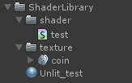
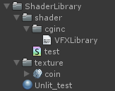

## 使用原理

cginc是Unity官方封装的函数，07着色器语义章节中也提到过。什么是封装？通俗点理解就是整理好一个工具箱，我需要使用时就去调用它。

> 清楚这个知识点后，我们就可以整理直接的工具库了。好记性不如烂笔头

这里建立一个shader库框架如下：



test是一个基础的UnlitShader用来做示意。来到代码中如果注释```#include "UnityCG.cginc"```会发现Shader报错了，因为shader运用了很多的内置函数。

##  封装cginc

cginc是无法直接创建的我们可以在shader文件夹下创建一个txt再把后缀改成 cginc 

```js
#include "UnityCG.cginc"
#include "test.cginc"
```

接下来进行测试在 test.cginc 文件里写入一个函数

```js
// test.cginc 文件
fixed4 TEST()
{
    return fixed4(1,0,0,0);
}
```

```js
// Shader 文件
return col + TEST();
```

会发现Shader进行了正常的运算，显示加上了一层红色。注释```#include "test.cginc"```后就报错了。明白原理后就可以开始整理直接的资料库了。单独建一个cginc文件夹进行归类。



此时就不能直接引用``` test.cginc```了需要使用相对路径

```js
#include "UnityCG.cginc"
#include "cginc/VFXLibrary.cginc"
```

> 项目中暂时还未使用，没做过打包流程测试。但特效的shader也并不复杂不需要进行这样的封装。可以作为字典知识库积累。

这里封装一些美术中常用的混合方式<写入VFXLibrary.cginc文件>

```js
// 透明度混合
fixed4 Alpha(fixed4 a , fixed4 b)
{
    fixed4 col = a;
    col.rgb = a.rgb * (1 - b.a) + b.rgb * b.a;
    col.a = a.a *(1 - b.a)+ b.a;
    return col;
}

// 正片叠底
fixed4 Multiply(fixed4 a , fixed4 b)
{
    fixed4 col = a;
    b.rgb = (b * b.a) + (1 - b.a);
    col.rgb = a.rgb * b.rgb;
    col.a = a.a + b.a;
    return col;
}

// 滤色
fixed4 Screen(fixed4 a , fixed4 b)
{
    fixed4 col = a;
    b.rgb = b.rgb * b.a;
    col.rgb = 1- (1 - a.rgb) * (1 - b.rgb);
    col.a = a.a + b.a;
    return col;
}

// 线性减淡 Add模式
fixed4 LinearDodge(fixed4 a , fixed4 b)
{
    fixed4 col = a;
    b.rgb = b.rgb * b.a;
    col = a + b;
    return col;
}
```

## 测试代码

```js
Shader "Example01/14叠加模式"
{
    Properties
    {
        _Tex1 ("Tex1", 2D) = "black" {}
        _Tex2 ("Tex2", 2D) = "black" {}
    }
    SubShader
    {
        Tags
        { 
            "Queue" = "Transparent"
            "RenderType" = "Transparent"
            "PreviewType" ="Plane"
        }
        
        Cull Off
        Lighting Off
        ZWrite Off
        Blend SrcAlpha OneMinusSrcAlpha
        Pass
        {
            CGPROGRAM
            #pragma vertex vert
            #pragma fragment frag
            #include "UnityCG.cginc"
            #include "cginc/VFXLibrary.cginc"

            struct appdata
            {
                float4 vertex : POSITION;
                float2 uv : TEXCOORD0;
            };


            struct v2f
            {
                float4 vertex : SV_POSITION;
                float2 uv : TEXCOORD0;
            };

            sampler2D _Tex1;
            sampler2D _Tex2;

            v2f vert (appdata v)
            {
                v2f o;
                o.vertex = UnityObjectToClipPos(v.vertex);
                o.uv = v.uv;
                return o;
            }

            fixed4 frag (v2f i) : SV_Target
            {
                fixed4 col1 = tex2D(_Tex1, i.uv);
                fixed4 col2 = tex2D(_Tex2, i.uv);
                // return Alpha(col1,col2);        // 透明度叠加
                return Multiply(col1,col2);     // 正片叠底
                // return Screen(col1,col2);       // 滤色
                // return LinearDodge(col1,col2);  // 线性减淡 就是通常说的Add模式
            }
            ENDCG
        }
    }
}
```

> 到此章节入门篇完结！后续工程会新增一些Shader但不写md文档了，尽量注释清楚。