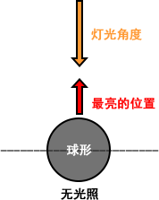
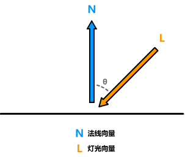

##  完整代码

```js
Shader "Example02/02顶点漫反射着色器"
{
    Properties
    {
        _MainColor("MainColor",Color) =(1,1,1,1)
        _MainTex ("Texture", 2D) = "white" {}
    }
    SubShader
    {
        Tags 
        {
            "RenderType"="Opaque"
            "LightMode"="ForwardBase"   //前向渲染基类
        }
        
        Pass
        {
            CGPROGRAM
            #pragma vertex vert
            #pragma fragment frag
            #include "UnityCG.cginc"
            #include "Lighting.cginc"   //引入灯光cginc
            
            struct v2f
            {
                float4 vertex : SV_POSITION;
                float2 texcoord : TEXCOORD0;
                fixed3 color : Color;
            };

            sampler2D _MainTex;
            float4 _MainTex_ST;
            fixed4 _MainColor;
            
            v2f vert (appdata_base v)
            {
                v2f o;
                o.vertex = UnityObjectToClipPos(v.vertex);
                o.texcoord = TRANSFORM_TEX(v.texcoord, _MainTex);
                
                // 固定的
                fixed3 worldPos = UnityObjectToWorldDir(v.vertex);          // 顶点 => 世界坐标
                fixed3 worldNormal = UnityObjectToWorldNormal(v.normal);    // 法线 => 世界坐标
                fixed3 lightDir = UnityWorldSpaceLightDir(worldPos);        // 光源向量
                fixed3 ambient = UNITY_LIGHTMODEL_AMBIENT.xyz;              // 环境光
                
                //漫反射计算
                fixed3 diffuse = _LightColor0.rgb * _MainColor.rgb * max(0,dot(worldNormal, lightDir));
                o.color = diffuse + ambient; // 环境颜色
                return o;
            }
            fixed4 frag (v2f i) : SV_Target
            {
                fixed3 col = tex2D(_MainTex, i.texcoord);
                col.rgb *= i.color.rgb; // 混合计算
                return  fixed4(col,1);
            }
            ENDCG
        }
    }
}
```

## 材质效果


## 源码分析

```js
Tags 
{
    "RenderType"="Opaque"
    "LightMode"="ForwardBase"   //前向渲染基类
}
```

``"LightMode"="ForwardBase"`` 光照模型 前向渲染标签 。后续还会学到其他类型，默认写上就好。

``#include "Lighting.cginc"`` 既然是光照Shader就自然要引入灯光文件。

```js
//固定的
fixed3 ambient = UNITY_LIGHTMODEL_AMBIENT.xyz;              // 环境光
fixed3 worldPos = UnityObjectToWorldDir(v.vertex);          // 转换世界空间
fixed3 worldNormal = UnityObjectToWorldNormal(v.normal);    // 转换世界空间
fixed3 lightDir = UnityWorldSpaceLightDir(worldPos);        // 光源向量
```

这一片代码都是光照计算固定写法大同小异，详细代码可以查询**CGIncludes。**

## 计算原理

先通俗理解下现实光照假设“平行光”打在球体上，球的正面是最亮的。可以理解为球体与光照射垂直的角度是最亮的，随着球面与灯光角度的偏移越来越暗。



换算成数学就是模型法线向量与光照向量的cosθ计算，获得了灯光的强度。



## 兰伯特计算公式

$$
C_{diffse}=C_{light}*C_{diffuse} * max（0，\vec{N}·\vec{L})
$$

$$
漫反射=灯光颜色*漫反射颜色*(0,法线向量·灯光向量)
$$

看着可能比较懵逼，直接带入代码可能就比较好理解了

```js
//漫反射计算
fixed3 diffuse = _LightColor0.rgb * _MainColor.rgb * max(0,dot(worldNormal, lightDir));
o.color = diffuse + ambient; // 环境颜色相加
```

重点计算就是**法线**点乘**灯光**方向。``dot``点乘初略理解就是计算得两个向量的夹角、朝向自己则为1完全反向时则为-1这样就可以理解**法线向量**与**灯光向量**的计算了。``max()``只是为了防止涂抹，并不需要为负数的值在背面也看不到。

## 输入结构体补充

```v2f vert (appdata_base v)```中``appdata_base ``是Unity封装的结构体可以直接使用。

```js
struct appdata_base {
    float4 vertex : POSITION;
    float3 normal : NORMAL;
    float4 texcoord : TEXCOORD0;
    UNITY_VERTEX_INPUT_INSTANCE_ID
};

struct appdata_tan {
    float4 vertex : POSITION;
    float4 tangent : TANGENT;
    float3 normal : NORMAL;
    float4 texcoord : TEXCOORD0;
    UNITY_VERTEX_INPUT_INSTANCE_ID
};

struct appdata_full {
    float4 vertex : POSITION;
    float4 tangent : TANGENT;
    float3 normal : NORMAL;
    float4 texcoord : TEXCOORD0;
    float4 texcoord1 : TEXCOORD1;
    float4 texcoord2 : TEXCOORD2;
    float4 texcoord3 : TEXCOORD3;
    fixed4 color : COLOR;
    UNITY_VERTEX_INPUT_INSTANCE_ID
};
```

> 下一章介绍片元着色器。