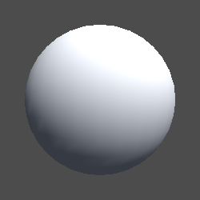
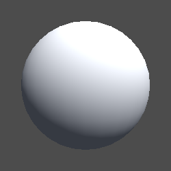

## 完整代码

```js
Shader "Example02/03片元漫反射着色器"
{
    Properties
    {
        _MainColor("MainColor",Color) =(1,1,1,1)
        _MainTex ("Texture", 2D) = "white" {}
    }
    SubShader
    {
        Tags {
            "RenderType"="Opaque"
            "LightMode"="ForwardBase"
        }
        Pass
        {
            CGPROGRAM
            #pragma vertex vert
            #pragma fragment frag
            #include "UnityCG.cginc"
            #include "Lighting.cginc"
            struct v2f
            {
                float4 vertex : SV_POSITION;
                float3 worldPos : TEXCOORD0;
                float2 texcoord : TEXCOORD1;
                fixed3 normal : NORMAL;
            };

            fixed4 _MainColor;
            sampler2D _MainTex;
            float4 _MainTex_ST;

            v2f vert (appdata_base v)
            {
                v2f o;
                o.vertex = UnityObjectToClipPos(v.vertex);
                o.worldPos = mul(unity_ObjectToWorld, v.vertex);
                o.texcoord =TRANSFORM_TEX(v.texcoord,_MainTex);
                o.normal = v.normal;
                return o;
            }
            fixed4 frag (v2f i) : SV_Target
            {
                // 固定的
                fixed3 worldNormal = normalize(UnityObjectToWorldNormal(i.normal)); // 法线 => 世界坐标
                fixed3 lightDir = normalize(UnityWorldSpaceLightDir(i.worldPos));   // 光源向量
                fixed3 ambient = UNITY_LIGHTMODEL_AMBIENT.xyz;                      // 环境光
                
                fixed3 col = tex2D(_MainTex, i.texcoord);

                //漫反射计算
                fixed3 diffuse = _LightColor0.rgb * _MainColor.rgb * max(0,dot(worldNormal, lightDir));
                col.rgb *= diffuse + ambient;   // 混合计算

                return  fixed4(col,1);
            }
            ENDCG
        }
    }
}
```

## 材质效果



似乎好像和顶点漫反射着色器一模一样没有改变。但是仔细观察可以发现，顶点着色器并不平滑像一个个顶点连接的。片源着色器则就非常的平滑。两者的代码区别仅只是放在顶点或者片元区域计算而已。

#### 顶点做色器<逐顶点>

即对每个片元（模型中的三角面）的顶点进行光照计算，然后进行插值计算填充整个面。

#### 片元着色器<逐像素>

即对每个片元直接进行填充，在片元着色器中进行。其计算量比逐顶点的光照计算大。

> 说人话就是**模型顶点**计算量和**像素**计算量的区别。前者性能好，后者效果好。详细原理 Google 必应 百度。