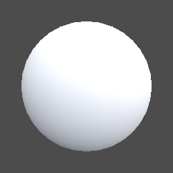

## 完整代码

```js
Shader "Example02/04半兰伯特着色器"
{
    Properties
    {
        _MainColor("MainColor",Color) =(1,1,1,1)
        _MainTex ("Texture", 2D) = "white" {}
    }
    SubShader
    {
        Tags {
            "RenderType"="Opaque"
            "LightMode"="ForwardBase"
        }
        Pass
        {
            CGPROGRAM
            #pragma vertex vert
            #pragma fragment frag
            #include "UnityCG.cginc"
            #include "Lighting.cginc"
            struct v2f
            {
                float4 vertex : SV_POSITION;
                float3 worldPos :TEXCOORD1;
                float2 texcoord : TEXCOORD0;
                fixed3 normal : NORMAL;
            };

            fixed4 _MainColor;
            sampler2D _MainTex;
            float4 _MainTex_ST;

            v2f vert (appdata_base v)
            {
                v2f o;
                o.vertex = UnityObjectToClipPos(v.vertex);
                o.worldPos = mul(unity_ObjectToWorld, v.vertex);
                o.texcoord =TRANSFORM_TEX(v.texcoord,_MainTex);
                o.normal = v.normal;
                return o;
            }
            fixed4 frag (v2f i) : SV_Target
            {
                // 固定的
                fixed3 worldNormal = normalize(UnityObjectToWorldNormal(i.normal));     // 法线 => 世界坐标
                fixed3 lightDir = normalize(UnityWorldSpaceLightDir(i.worldPos));       // 光源向量
                fixed3 ambient = UNITY_LIGHTMODEL_AMBIENT.xyz;                          // 环境光
                
                fixed3 col = tex2D(_MainTex, i.texcoord);

                //半兰伯特
                fixed3 diffuse = _LightColor0.rgb * _MainColor.rgb * max(0,dot(worldNormal, lightDir)* 0.5 + 0.5);
                col.rgb *= diffuse + ambient;   // 混合计算

                return  fixed4(col,1);
            }
            ENDCG
        }
    }
}
```

## 材质效果



## 半兰伯特计算公式

综合兰伯特的暗面过于死黑问题。将<-1,1>转换到<0,1>的常用方法 x/2+0.5
$$
C_{diffse}=C_{light}*C_{diffuse}*max（0，\vec{N}·\vec{L}*0.5+0.5)
$$

> 半兰伯特属于经验模型，属于服务美术效果没有参考依据。