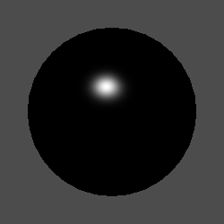
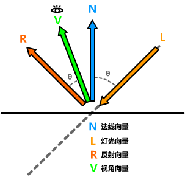

## 完整代码

```js
Shader "Example02/05片元反射着色器"
{
    Properties
    {
        _MainColor("MainColor",Color) =(1,1,1,1)
        _MainTex ("Texture", 2D) = "white" {}
        _Gloss("Gloss",Range(0.03,1)) =0.5

        [KeywordEnum (Phong,Blinn)] SPECULARTYPE("Specular光照模型", Float) = 0 //宏定义
    }
    SubShader
    {
        Tags {
            "RenderType"="Opaque"
            "LightMode"="ForwardBase"
        }
        Pass
        {
            CGPROGRAM
            #pragma vertex vert
            #pragma fragment frag
            #include "UnityCG.cginc"
            #include "Lighting.cginc"
            #pragma multi_compile SPECULARTYPE_PHONG SPECULARTYPE_BLINN //宏定义

            struct v2f
            {
                float4 vertex : SV_POSITION;
                float3 worldPos : TEXCOORD0;
                float2 texcoord : TEXCOORD1;
                fixed3 normal : NORMAL;
            };

            fixed4 _MainColor;
            sampler2D _MainTex;
            float4 _MainTex_ST;
            fixed _Gloss;

            v2f vert (appdata_base v)
            {
                v2f o;
                o.vertex = UnityObjectToClipPos(v.vertex);
                o.worldPos = mul(unity_ObjectToWorld, v.vertex);
                o.texcoord =TRANSFORM_TEX(v.texcoord,_MainTex);
                o.normal = v.normal;
                return o;
            }

            //--- Phong反射 ------------------------------
            fixed3 SpecularPhong(fixed3 lightColor,fixed4 specularCol, fixed3 viewDir, fixed3 reflectDir,fixed gloss)
            {
                return lightColor * specularCol.rgb * specularCol.a * pow(max(0,dot(viewDir,reflectDir)), gloss);
            }

            //--- Blinn-Phong反射  ------------------------------
            fixed3 SpecularBlinn(fixed3 lightColor,fixed4 specularCol,fixed3 worldNormal,fixed3 halfDir,fixed gloss)
            {
                return lightColor * specularCol.rgb * specularCol.a * pow(max(0,dot(worldNormal, halfDir)), gloss);
            }

            fixed4 frag (v2f i) : SV_Target
            {
                //固定的
                fixed3 worldNormal = normalize(UnityObjectToWorldNormal(i.normal)); // 法线 => 世界坐标
                fixed3 lightDir = normalize(UnityWorldSpaceLightDir(i.worldPos));   // 光源向量
                fixed3 viewDir = normalize(UnityWorldSpaceViewDir(i.worldPos));     // 视角向量
                fixed3 reflectDir = normalize(reflect(-lightDir,worldNormal));      // 反射向量
                fixed3 halfDir = normalize(lightDir + viewDir);                     // 半角方向
                
                fixed3 col = tex2D(_MainTex, i.texcoord);

                fixed3 specularCol;
                #ifdef SPECULARTYPE_PHONG 
                    specularCol = SpecularPhong(_LightColor0,_MainColor,viewDir,reflectDir,_Gloss * 128);  // Phong反射
                #elif SPECULARTYPE_BLINN
                    specularCol = SpecularBlinn(_LightColor0,_MainColor,worldNormal,halfDir,_Gloss * 128);   // Blinn反射
                #endif

                col.rgb *= specularCol; // 混合计算
                return  fixed4(col,1);
            }
            ENDCG
        }
    }
}
```

## 材质效果



### 计算原理

漫反射中已经介绍了光照模型法线计算原理，反射则是通过光源向量计算反射光源。再计算眼睛所看到的反光。



当视角垂直于反射向量```（θ = 0）```时反射全部返回到摄像机，随着角度变大而衰减。

## Phong反射计算公式

传统计算公式
$$
C_{specular}=(c_{light}*M_{specular})*max(0,	\hat{V}·R)^{m^{gloss}}
$$

$$
反射=(灯光颜色*反射颜色)*max(0,法线向量·半角向量)^{光泽度}
$$

### Blinn-Phong 反射计算公式

Blinn-Phong 相比 Phong 高光更柔和、更平滑，此外它在速度上相当快。接近真实Phong高光，因此成为许多 CG 软件中的默认光照渲染方法。
$$
C_{specular}=(c_{light}*M_{specular})*max(0,\hat{N}·\hat{H})^{m^{gloss}}
$$

$$
反射=(灯光颜色*反射颜色)*max(0,法线向量·半角向量)^{光泽度}
$$

> 只是计算公式不同大部分代码是相同的，使用了宏定义。照抄即可不清楚 可以百度 Googl 必应。顶点反射就不再讲述了只是放在顶点或者片元区域的计算区别而已。