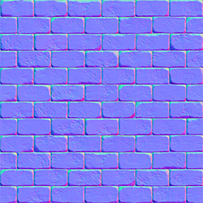
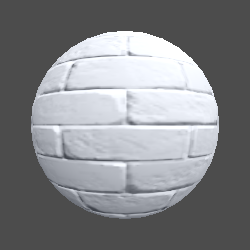

## 完整代码

```js
Shader "Example02/06法线着色器"
{
    Properties
    {
        _MainColor ("MainColor",Color) =(1,1,1,1)
        _MainTex("MainTex",2d) ="white" {}
        _BumpMap("NormalMap",2D) = "bump" {}
        _BumpScale("NormalScale",Range(-1,1)) = 1
    }
    SubShader
    {
        Tags 
        {
            "RenderType"="Opaque"  
            "LightMode"="ForwardBase"
        }

        Pass
        {
            CGPROGRAM
            #pragma vertex vert
            #pragma fragment frag

            #include "UnityCG.cginc"
            #include "Lighting.cginc"
            
            struct v2f
            {
                float4 vertex : SV_POSITION;
                float2 texcoord: TEXCOORD0; // 贴图UV
                float3 worldPos: TEXCOORD1; // 世界坐标
                float3 tSpace0: TEXCOORD2;  // TNB矩阵0
                float3 tSpace1: TEXCOORD3;  // TNB矩阵1
                float3 tSpace2: TEXCOORD4;  // TNB矩阵2
            };

            fixed4 _MainColor;
            sampler2D _MainTex;
            float4 _MainTex_ST;
            sampler2D _BumpMap;
            fixed _BumpScale;

            v2f vert (appdata_full v)
            {
                v2f o;
                o.vertex = UnityObjectToClipPos(v.vertex);                          // 顶点 => 裁剪空间
                o.worldPos = mul(unity_ObjectToWorld, v.vertex);                    // 顶点 => 世界坐标
                fixed3 worldNormal = UnityObjectToWorldNormal(v.normal);            // 法线 => 世界坐标
                fixed3 worldTangent = UnityObjectToWorldDir(v.tangent);             // 法线 => 世界坐标
                fixed3 worldBinormal = cross(worldNormal, worldTangent) * v.tangent.w * unity_WorldTransformParams.w;   // 副切线
                
                // 组合TBN矩阵 用于后续的切线空间法线计算。
                o.tSpace0 = float3(worldTangent.x, worldBinormal.x, worldNormal.x);
                o.tSpace1 = float3(worldTangent.y, worldBinormal.y, worldNormal.y);
                o.tSpace2 = float3(worldTangent.z, worldBinormal.z, worldNormal.z);
                o.texcoord = TRANSFORM_TEX(v.texcoord, _MainTex);   // UV缩放跟随主贴图
                return o;
            }

            fixed4 frag (v2f i) : SV_Target
            {
                fixed3 normal = UnpackNormal(tex2D(_BumpMap, i.texcoord)); 
                normal.xy *= _BumpScale;  // 计算法线强度
                
                //--- 切线空间法线（贴图）=> 世界空间法线 ------------------------------
                fixed3 worldNormal = normalize(half3(dot(i.tSpace0, normal), dot(i.tSpace1, normal), dot(i.tSpace2, normal)));
                fixed3 lightDir = normalize(UnityWorldSpaceLightDir(i.worldPos));   // 光源向量
                fixed3 viewDir = normalize(UnityWorldSpaceViewDir(i.worldPos));     // 视角向量
                fixed3 reflectDir = normalize(reflect(-lightDir,worldNormal));      // 反射向量
                fixed3 halfDir = normalize(lightDir + viewDir);                     // 半角方向
                fixed3 ambient = UNITY_LIGHTMODEL_AMBIENT.xyz;                      // 环境光

                fixed3 col = tex2D(_MainTex, i.texcoord);
                
                // 半兰伯特
                fixed3 diffuse = _LightColor0.rgb * _MainColor.rgb * max(0,dot(worldNormal, lightDir)* 0.5 + 0.5);
                
                col *= diffuse + ambient;   // 混合计算
                return fixed4(col,1);
            }
            ENDCG
        }
    }
}
```

## 材质效果

 

大致原理通过模型的法线、切线计算出**负切线**组合TBN矩阵，再和法线贴图点乘组合成``worldNormal``进行后续的光照模型计算。

> 底层原理就牵扯到复杂的数学运算了，才疏学浅只能作为搬运工组合代码了。