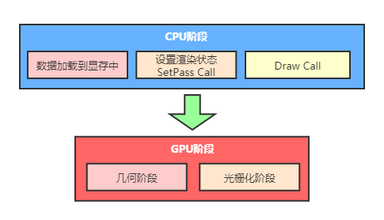

## URP的性能优势

###  对比差异

Shader为单Pass实时光照、用单Pass ColorTexture代替GrabPass

- **Buitin管线**  每添加一个顶点光源Pass就会成倍增长 移动端基本不可能使用。GrabPass(全屏抓取)后处理不会降分辨率 而且抓取次数是未知的(是一个黑箱)。
- **URP管线**  单Pass附加光源则采用for循环实现。ColorTexture 通过一次抓取完成所有需要操作的渲染，性能会提升非常多且是可控的。

### SRP Batcher如何工作

Unity中是可以随时修改材质的属性的。但伴随这一些缺点。例如当一个DrawCall使用一个新的Material时，会有很多流程工作要处理(SetPass Call)。因此场景中有越多的Material就会调用更多的CPU来设置GPU数据。

传统的处理方式是减少DrawCalls的数量来优化CPU渲染成本(减少Material贴图数量等)。真正的消耗是SetPass Call而不是GPU DrawCall本身，它只是提交缓冲区的数据到GPU。

SRP Batcher通过批量处理Bind和Draw GPU命令的序列，减少DrawCalls之间的GPU设置。

### SRP Batcher 流程

渲染流程分为GPU阶段和GPU阶段。**SRP Batcher** 主要是针对CPU的优化，性能消耗的重头则是**SetPass Cal**l渲染状态。对比**Standard Batcher** 和**SRP Batcher**的官方流程图。

- 标准的管线流程则非常繁琐
  - 收集Object数据提交到CBuffer缓存--> 提交GPU
  - 收集Material数据提交到CBuffer缓存--> 提交到GPU
  - 绑定 Object
  - 绑定 Material
  - 最后在调用Draw Call
  - **发生材质球Material改变时重新SetShaderPass**

- URP渲染管线则优化了流程
  - 绑定 Material 提交到CBuffer缓存
  - 绑定 Object 提交到CBuffer缓存
  - 最后在调用Draw Call
  - **发生Shader改变时重新SetShaderPass***

## Unity合批方式

- **Static Batching（静态合批）**
  -  对动态物体是无效的，且内存占用巨大，对LOD不友好。
- **GPU Instancing（GPU实例化）**
  - 仅对Mesh和Material均完全一致的情况下生效（比如一片草什么的）优先级比静态低，比动态高。对于一些大型多人的游戏，或是SLG这种，是种很实用的技术。
- **Dynamic Batching（动态合批）**
  - 要求苛刻（比如三角面数等），且CPU开销大。

## SRP Batcher总结

1、在过去的渲染架构中，Unity采取对一个材质分配一个CBuffer或则一个Pass，这个CBuffer包括shader里的显性的参数所以每一次Draw Call，要更新这个CBuffer。

2、在SRP渲染架构中，Unity采取的策略是对一个材质分配**一个半CBuffer**。首先shader的显性参数分配到一个CBuffer里，Shader的隐性参数则是多个物体共享一个CBuffer。比如一个Shader 对应 10个物体，在SRP渲染架构中，一共分配了11个CBuffer，其中10个分别存这10个物体材质中定义的显性参数。然后分配一个大的CBuffer，把这10个物体的ModelMatrix这类隐性参数都放在一起。乍一看下还多了一个CBuffer，**但这个像似UI的动静分离策略**。材质的显性参数大部分都是低频更新的，在理想情况下这10个显性参数的CBuffer基本不会修改。ModelMatrix之类的隐性参数是高频更新的（模型运动）。它们被批量放在一个CBuffer里，一次更新可以更新一片。

