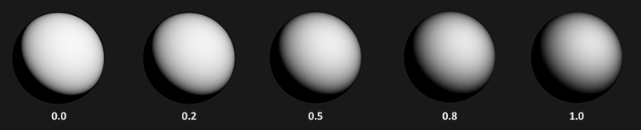
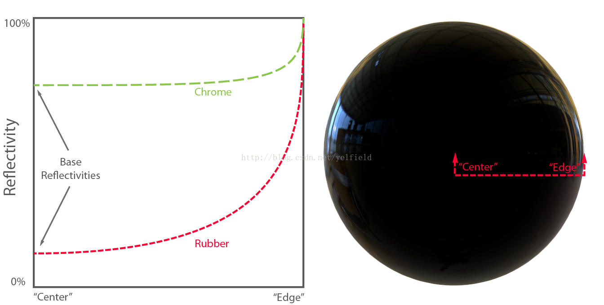

PBR是基于物理的渲染光照模型。原型是迪士尼提出的BRDF发展出的一套工作流程。现在游戏通用的是金属流PBR。应用层面基本也就是照抄公式，拓展性也只是根据项目需求增删替换其中的公式。
## PBR光照组成

- 微表面分布函数（Normal Distribution Function）
- 几何阴影函数（Geometric Shadowing Function）
- 菲涅尔函数（Fresnel Function）

## 微表面分布函数

当光线照射物体时会产生反射。对于越粗糙的表面它的反射则越不规则(也就是漫反射)，反之越光滑的物体反射的光越规则整齐（也就是反射高光）。


**能量守恒：**微平面理论就采用近似的能量守恒：出射光的总能量不超过入射光的总能量（自发光材质除外）。粗糙度变化图可以看出，材质粗糙度越大，反射的范围越大，但整体亮度变暗。



## 几何阴影函数

计算自身微表面投影产生的光照衰减。为了模拟微表面之间的相互遮挡或则光线在多个微表面之间的相互反射。是BRDF能量守恒的精华，如果没有几何阴影函数，BRDF可能会反射出比接收的光线更多的光照能量。

## 菲尼尔函数

菲涅尔效应：简单的讲，就是视线垂直于表面时，反射较弱，而当视线非垂直表面时，夹角越小，反射越明显。如果你看向一个圆球，那圆球中心的反射较弱，靠近边缘较强。



## PBR实现

如果想要真正的PBR，而不只是为了加上法线高光，直接使用Unity封装好的PBR是最好的。直接光照部分也没啥好改的，间接光照默认的Unity的一套光照烘焙。而且大部分项目应该都用不到PBR。

如果游戏场景的布光不基于真实光照，而采用各种点光源进行补光追求艳丽的画面风格。又或则没有法线、高光或则光源、材质贴近现实也没有意义。这是整套系统！

```js
Shader "URPExample/02复杂光照/04PBR光照"
{
    Properties
    {
        _BaseColor("Color",Color) = (1,1,1,1)
        _BaseMap("Texture",2D) = "white"{}
        _MetallicGlossMap("Metallic", 2D) = "white" {}
        _Metallic("Metallic",Range(0,1)) = 0.5
        _Smoothness("Smoothness",Range(0,1)) = 0.5
        _BumpMap("NormalMap",2D) = "bump" {}
        _BumpScale("NormalScale",Range(-1,1)) = 1
    }
    SubShader
    {
        Tags
        {
            "RenderPipeline"="UniversalRenderPipeline"
            "LightMode"="UniversalForward"
            "RenderType"="Opaque"
        }

        HLSLINCLUDE
        #include "Packages/com.unity.render-pipelines.universal/ShaderLibrary/Core.hlsl"
        #include "Packages/com.unity.render-pipelines.universal/ShaderLibrary/Lighting.hlsl"

        #pragma multi_compile _ _ADDITIONAL_LIGHTS_VERTEX _ADDITIONAL_LIGHTS  //附加灯光宏
        #pragma multi_compile _ _MAIN_LIGHT_SHADOWS         //主光源阴影宏
        #pragma multi_compile _ _MAIN_LIGHT_SHADOWS_CASCADE //主光源阴影宏
        #pragma multi_compile _ _SHADOWS_SOFT   //软阴影宏

        TEXTURE2D(_BaseMap); SAMPLER(sampler_BaseMap);
        TEXTURE2D(_MetallicGlossMap); SAMPLER(sampler_MetallicGlossMap);
        TEXTURE2D(_BumpMap); SAMPLER(sampler_BumpMap);

        CBUFFER_START(UnityPerMaterial)
        float4 _BaseMap_ST;
        half4 _BaseColor;
        half _Metallic;
        half _Smoothness;
        half _BumpScale;
        CBUFFER_END
        ENDHLSL
        
        pass
        {
            HLSLPROGRAM
            #pragma vertex vert
            #pragma fragment frag
            
            struct a2v
            {
                float4 positionOS : POSITION;
                float3 normalOS : NORMAL;
                float4 tangentOS : TANGENT;
                float2 texcoord : TEXCOORD;
            };
            struct v2f
            {
                float4 positionCS : SV_POSITION;
                float3 positionWS : TEXCOORD0;
                float3 tSpace0: TEXCOORD1;
                float3 tSpace1: TEXCOORD2;
                float3 tSpace2: TEXCOORD3;
                float2 texcoord : TEXCOORD4;
            };
            
            v2f vert(a2v v)
            {
                v2f o;
                o.positionCS = TransformObjectToHClip(v.positionOS.xyz);    //To裁剪空间
                o.positionWS = TransformObjectToWorld(v.positionOS.xyz);    //To世界空间

                float3 normalWS = TransformObjectToWorldNormal(v.normalOS.xyz); //To世界空间
                float3 TangentWS = TransformObjectToWorldDir(v.tangentOS.xyz);  //To世界空间
                float3 BinormalWS = cross(normalWS, TangentWS) * v.tangentOS.w * unity_WorldTransformParams.w;  //计算副切线
                
                //组合TBN矩阵 用于后续的切线空间法线计算。
                o.tSpace0 = float3(TangentWS.x, BinormalWS.x, normalWS.x);
                o.tSpace1 = float3(TangentWS.y, BinormalWS.y, normalWS.y);
                o.tSpace2 = float3(TangentWS.z, BinormalWS.z, normalWS.z);

                o.texcoord = TRANSFORM_TEX(v.texcoord,_BaseMap);    //UV计算
                return o;
            }

            half4 frag(v2f i):SV_Target
            {
                Light light = GetMainLight(TransformWorldToShadowCoord(i.positionWS));  //获取主光源、阴影
                float3 lightDir = normalize(light.direction);   //归一化

                //--- 切线空间法线（贴图）=> 世界空间 ------------------------------
                float3 normalTS = UnpackNormalScale(SAMPLE_TEXTURE2D(_BumpMap, sampler_BumpMap, i.texcoord),_BumpScale);
                float3 normalWS = normalize(half3(dot(i.tSpace0, normalTS), dot(i.tSpace1, normalTS), dot(i.tSpace2, normalTS)));
                float3 viewDir = normalize(_WorldSpaceCameraPos.xyz - i.positionWS); //视角向量
              
                //--- 数据准备 ------------------------------
                half4 albedo = SAMPLE_TEXTURE2D(_BaseMap, sampler_BaseMap, i.texcoord); //固有色
                half4 metallicGlossMap = SAMPLE_TEXTURE2D(_MetallicGlossMap, sampler_MetallicGlossMap, i.texcoord);  //金属贴图

                half metallic = metallicGlossMap.r * _Metallic;     //金属度
                half smoothness = metallicGlossMap.a *_Smoothness;  //光泽度
                half specular = 1;
                half occlusion = metallicGlossMap.g;
                half emission = 0;

                //--- 初始化PBR数据 ------------------------------
                half alpha = 1;
                BRDFData brdfData;
                InitializeBRDFData(albedo.rgb, metallic, specular, smoothness, alpha,brdfData);
                
                //混合GI 自定义
                half3 bakedGI = SampleSH(normalWS);
                MixRealtimeAndBakedGI(light,normalWS,bakedGI, half4(0, 0, 0, 0));

                //计算环境光照
                half3 color = GlobalIllumination(brdfData, bakedGI, occlusion, normalWS, viewDir);
                
                //计算直接光照
                color += LightingPhysicallyBased(brdfData, light, normalWS, viewDir);

                //辅助照明
                #ifdef _ADDITIONAL_LIGHTS
                    uint pixelLightCount = GetAdditionalLightsCount();
                    for (uint lightIndex = 0u; lightIndex < pixelLightCount; ++lightIndex)
                    {
                        Light light = GetAdditionalLight(lightIndex,i.positionWS);
                        color += LightingPhysicallyBased(brdfData, light, normalWS,viewDir);
                    }
                #endif

                //自发光
                color += emission;
                return half4(color, alpha);
            }
            ENDHLSL
        }

        //阴影Pass
        pass
        {
            Tags{"LightMode"="ShadowCaster"}
            HLSLPROGRAM
            #pragma vertex vertshadow
            #pragma fragment fragshadow

            struct a2v
            {
                float4 positionOS : POSITION;
                float3 normalOS : NORMAL;
                float2 texcoord : TEXCOORD;
            };
            struct v2f
            {
                float4 positionCS : SV_POSITION;
                float3 positionWS : TEXCOORD0;
                float3 normalWS : TEXCOORD1;

            };
            
            v2f vertshadow(a2v v)
            {
                v2f o;
                Light MainLight = GetMainLight();
                o.positionWS = TransformObjectToWorld(v.positionOS.xyz);
                o.normalWS = TransformObjectToWorldNormal(v.normalOS.xyz);
                o.positionCS = TransformWorldToHClip(ApplyShadowBias(o.positionWS,o.normalWS,MainLight.direction));
                #if UNITY_REVERSED_Z
                    o.positionCS.z = min(o.positionCS.z,o.positionCS.w * UNITY_NEAR_CLIP_VALUE);
                #else
                    o.positionCS.z = max(o.positionCS.z,o.positionCS.w * UNITY_NEAR_CLIP_VALUE);
                #endif
                return o;
            }

            half4 fragshadow(v2f i):SV_Target
            {
                return 0;
            }
            ENDHLSL
        }
    }   
}
```

